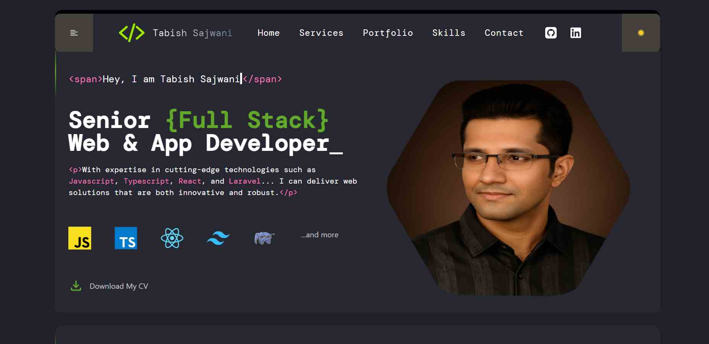

# 🚀 Personal Portfolio Website

This is fully responsive, modern, and clean personal portfolio website built using React + TypeScript. It showcase my projects, skills, qualification, and work experience with smooth animations and optimized performance.

# 📸 Live Demo

Website is live at: http://tabishsajwani.com/

# ✨ Features

- ⚛️ Built with React + TypeScript
- 🎨 Modern UI/UX Design
- 📱 Fully Responsive (Mobile, Tablet & Desktop)
- ⚡ Fast Loading and SEO Optimized
- 🌙 Dark Mode Support (Optional)
- 🎥 Smooth Scroll Animations & Transitions
- 🛠️ Easy to customize and expand

# 📂 Technologies Used

- React
- TypeScript
- Vite
- Tailwind CSS
- Framer Motion
- React Icons

# 📸 Screenshots



# 🚀 Getting Started

## Installation

```
git clone https://github.com/tabby8612/portfolio-v2
cd portfolio-v2
npm install
npm run dev
```

# 🛠️ Customization

- Update your personal details, social links, and content in the respective React components.
- Replace images/assets as needed.
- Customize styling using your preferred CSS framework.

# 📈 Deployment

You can easily deploy this portfolio using:

- Vercel
- Netlify
- GitHub Pages

# Contact

If you'd like to get in touch:

- Email: contact@tabishsajwani.com
- Linkedin: https://www.linkedin.com/in/tabish-sajwani/
- Website: http://tabishsajwani.com
